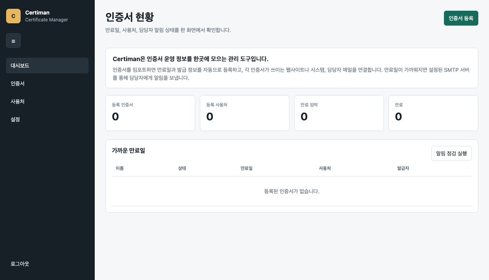

# Certiman

Certiman은 인증서, 인증서 사용처, 담당자, 만료 알림을 한곳에서 관리하는
웹 기반 인증서 운영 관리 도구입니다. 인증서를 임포트하면 만료일과 발급
정보를 자동으로 등록하고, 인증서가 사용되는 웹사이트나 시스템별 담당자에게
SMTP 기반 만료 알림을 발송할 수 있습니다.

Certiman is a small web application for managing TLS certificates, where they are
used, who owns each usage, and who should be notified before expiry.

## Screenshot



## Implemented Features

- Password-only login for the initial version.
- PEM certificate import.
- Automatic certificate metadata parsing:
  - subject
  - issuer
  - serial number
  - SHA-256 fingerprint
  - valid-from date
  - valid-to date
- Certificate dashboard with valid, expiring, and expired states.
- Certificate detail page with parsed certificate information.
- Usage registration per certificate.
- Usage categories for websites, APIs, servers, load balancers, mail, and other systems.
- Website URL or system identifier tracking per usage.
- Owner name and owner email tracking per usage.
- SMTP configuration screen.
- Settings page for access password changes and SMTP configuration.
- Collapsible sidebar navigation.
- Tabbed settings sections for security, SMTP, and usage categories.
- Usage category add, rename, and delete management.
- Manual notification check for expiring certificates.
- Daily 10:00 automatic notification check while the server is running.
- Certificate renewal-complete flag to suppress expiry status and notifications.
- AES-256-GCM encrypted data storage at rest.

## Requirements

- Node.js 20 or newer.
- No npm package install is required. The app uses only Node.js built-in modules.

Check your Node.js version:

```bash
node --version
```

## Installation

Clone the repository and enter the project directory:

```bash
git clone https://github.com/redplug/certiman.git
cd certiman
```

Start the server:

```bash
npm start
```

Open:

```text
http://<server-ip>:3040
```

## Login

The default login password is:

```text
admin
```

You can change the password from the `설정` page after logging in. Password
changes re-encrypt the server vault with the new password.

You can also set the first-run password before the encrypted vault is created:

```bash
CERTIMAN_PASSWORD='change-me' npm start
```

The encrypted vault is tied to the current app password. After the password is
changed in the settings page, use that new password for future logins. Changing
`CERTIMAN_PASSWORD` later does not rewrite an existing vault.

## Configuration

Environment variables:

| Variable | Default | Description |
| --- | --- | --- |
| `PORT` | `3040` | HTTP server port. |
| `HOST` | `0.0.0.0` | HTTP bind address. Set `127.0.0.1` for local-only access. |
| `CERTIMAN_PASSWORD` | `admin` | Login password and vault encryption key source. |
| `CERTIMAN_SESSION_SECRET` | random per process | Session cookie signing secret. |
| `CERTIMAN_TRUST_PROXY` | `false` | Use `X-Forwarded-For` / `X-Real-IP` for IP allowlist checks when running behind a trusted reverse proxy. |

Example:

```bash
HOST=0.0.0.0 PORT=3040 CERTIMAN_PASSWORD='change-me' npm start
```

## Access IP Restrictions

IP restrictions can be configured from `설정` → `접속 제한`.

- Single IPs and CIDR ranges are supported, such as `192.168.0.10`,
  `192.168.0.0/24`, and `2001:db8::/32`.
- When enabling the restriction, the current client IP must be included in the
  allowlist. This prevents accidentally locking out the active administrator.
- The access control file is stored separately at:

```text
data/access-control.json
```

It is loaded before login so restricted IPs are blocked before authentication.

## Data Storage

Application data is stored in:

```text
data/vault.json.enc
```

The vault contains certificates, usages, SMTP settings, and notification logs.
It is encrypted with AES-256-GCM. The encryption key is derived from the login
password using Node.js `crypto.scryptSync`.

The encrypted data file is intentionally excluded from Git.

The app does not use browser local storage, session storage, IndexedDB, or
client-side files for application settings. Sensitive HTML and JSON responses are
sent with `Cache-Control: no-store`, and forms disable browser autocomplete for
sensitive values. The browser only receives a signed session cookie for login
state; certificate data, usage records, owner contacts, SMTP settings, and
notification logs are stored on the server in the encrypted vault.

## SMTP Notifications

Configure SMTP from the `설정` page.

Required fields:

- SMTP host
- SMTP port
- sender address
- username and password, if your SMTP server requires authentication
- expiry warning threshold in days

Notification behavior:

- A certificate is considered expiring when its remaining days are less than or
  equal to the configured warning threshold.
- Notifications are sent to the owner email registered on each usage.
- The server checks automatically every day at 10:00 server local time.
- Automatic notifications are sent daily from the warning threshold through the
  certificate expiry date. Expired certificates are not mailed automatically.
- You can also run a manual check from the dashboard.
- The app avoids sending duplicate automatic notifications for the same
  certificate usage on the same local date.
- Certificates marked `갱신 완료` ignore the expiry date and do not send expiry
  notifications.
- The saved SMTP password is not rendered back into the browser. Leaving the
  field blank keeps the existing server-side encrypted value.
- Use the SMTP password delete checkbox when the stored password should be
  removed from the encrypted server vault.

## Development

Run the syntax check:

```bash
node --check src/server.js
```

Start the local server:

```bash
npm start
```

## Current Limitations

- Entra ID login is not implemented yet.
- There is no role-based access control yet.
- This initial version is intended to run behind a trusted reverse proxy or on a
  private network.
- SMTP support is implemented with Node.js built-in networking primitives.
